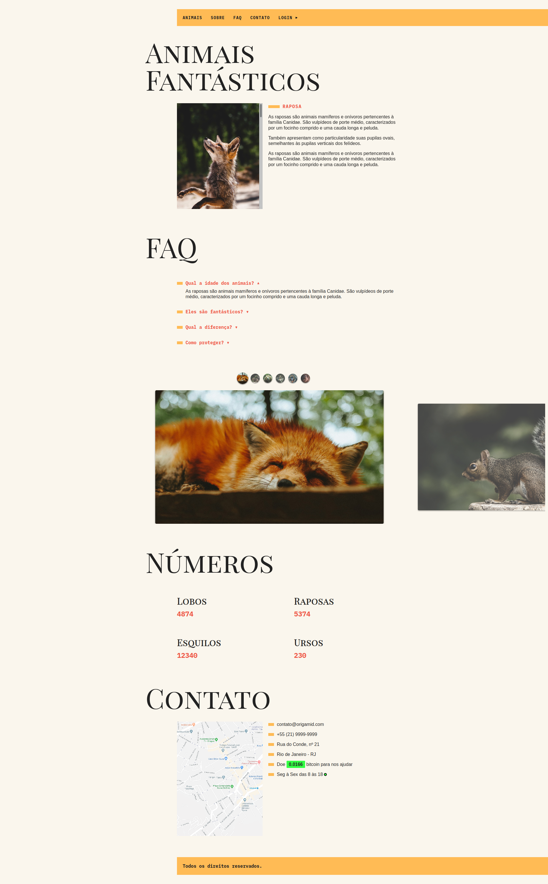

# Animais Fantásticos - [Demo](https://matheusgomesweb.github.io/cursos-origamid/AnimaisFantasticos/)

Projeto Final desenvolvido no Curso [JavaScript ES6 - Completo](https://www.origamid.com/curso/javascript-completo-es6/) da [Origamid](origamid.com/).

## Conceitos aplicados

* modules
* import, export
* fetch API
* Operadores Rest, Spread
* Classes
* Arrow Functions
* Event Loop
* const, let

e muitas novidades do JavaScript ES6

## Classes Criadas no Curso

* Accordion
* Animar Numeros
* Debounce
* Menu Mobile
* Menu Dropdown
* Funcionamento
* Modal
* Animar ao Scroll
* Scroll Suave
* Navegação por Tabs
* Tooltip

## Extra

### Slide Complexo - [Demo](https://matheusgomesweb.github.io/cursos-origamid/SlideAnimaisFantasticos/)

Criação de um slide complexo com miniaturas, eventos de touch no mobile etc...
