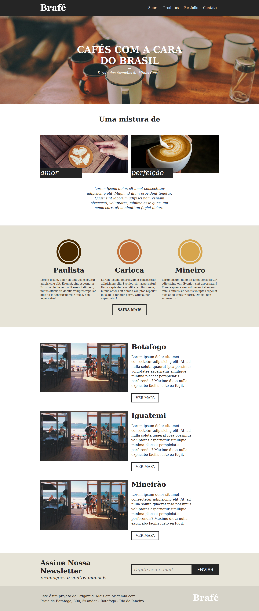

# CSS Avançado Posicionamento - Em Andamento

Curso de [CSS Avançado Posicionamento](https://www.origamid.com/curso/css-avancado-posicionamento) da [Origamid](https://www.origamid.com/), tem como objetivo passar de maneira exaustiva nos fundamentos das propriedades e como elas agem no layout do site.

Foram criados 3 projetos diferentes durante o curso. Cada um dos projetos foram codificados utilizando 4 maneiras diferentes. 

- A primeira da forma mais pura possível, definindo width’s e height’s
- A segunda com um sistema de grid pré definido
- A terceira com o Flexbox 
- e por último usando o Bootstrap.

___

## Demos

### Brafé - 1

- [Puro](https://matheusgomesweb.github.io/Cursos/Programacao/FrontEnd/Cursos-Origamid/CSS-Avancado-Posicionamento/Brafe-1/Brafe-Puro/index.html)
- [Grid](https://matheusgomesweb.github.io/Cursos/Programacao/FrontEnd/Cursos-Origamid/CSS-Avancado-Posicionamento/Brafe-1/Brafe-Grid/index.html)
- [Flexbox](https://matheusgomesweb.github.io/Cursos/Programacao/FrontEnd/Cursos-Origamid/CSS-Avancado-Posicionamento/Brafe-1/Brafe-Flexbox/index.html)
- [Bootstrap](https://matheusgomesweb.github.io/Cursos/Programacao/FrontEnd/Cursos-Origamid/CSS-Avancado-Posicionamento/Brafe-1/Brafe-Bootstrap/index.html)

___

### Brafé - 2

- [Puro](https://matheusgomesweb.github.io/Cursos/Programacao/FrontEnd/Cursos-Origamid/CSS-Avancado-Posicionamento/Brafe-1/Brafe-2-Puro/index.html)
- [Grid](https://matheusgomesweb.github.io/Cursos/Programacao/FrontEnd/Cursos-Origamid/CSS-Avancado-Posicionamento/Brafe-1/Brafe-2-Grid/index.html)
- [Flexbox](https://matheusgomesweb.github.io/Cursos/Programacao/FrontEnd/Cursos-Origamid/CSS-Avancado-Posicionamento/Brafe-1/Brafe-2-Flexbox/index.html)
- [Bootstrap](https://matheusgomesweb.github.io/Cursos/Programacao/FrontEnd/Cursos-Origamid/CSS-Avancado-Posicionamento/Brafe-1/Brafe-2-Bootstrap/index.html)
