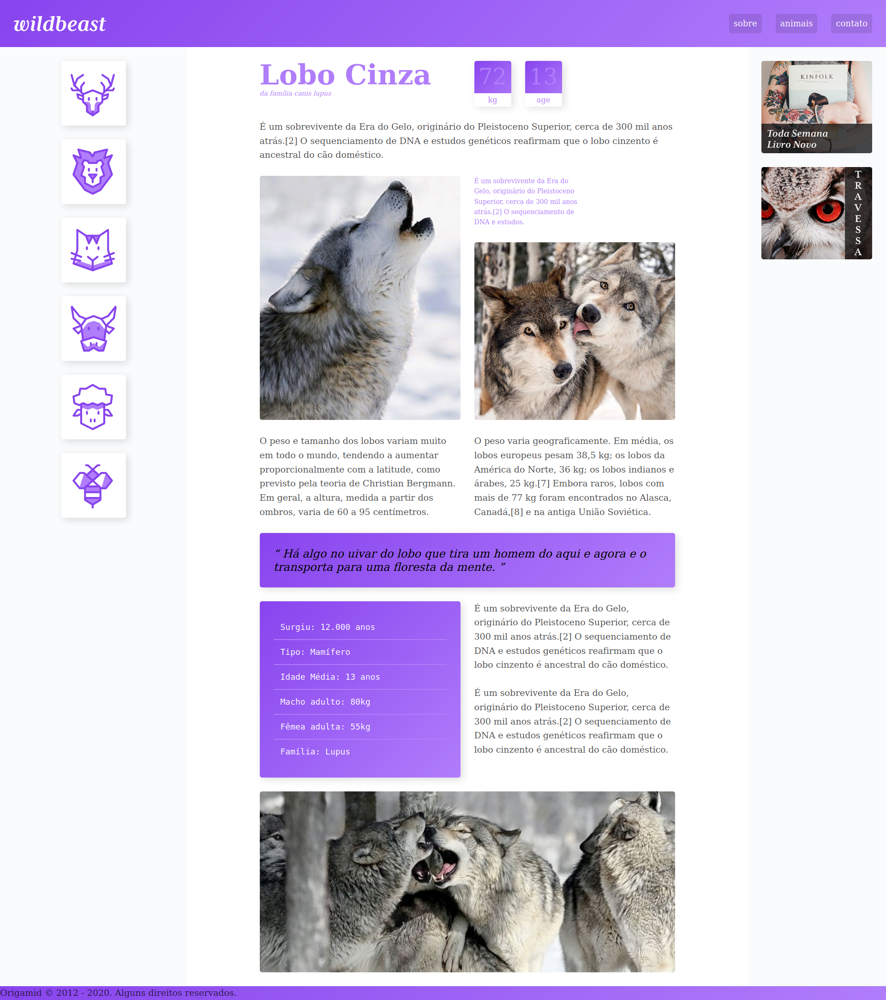

# CSS Grid Layout - Concluído

## Projeto: Wildbeast - [Demo](https://matheusgomesweb.github.io/Cursos/Programacao/FrontEnd/Cursos-Origamid/CSS-com-Grid-layout/index.html)

___

## Sobre

Projeto desenvolvido no Curso [CSS Grid Layout](https://www.origamid.com/curso/css-grid-layout/) da [Origamid](origamid.com/)

___

## Minhas modificações

* **Estilos**
  + código com SASS

* **JavaScript**
  + Modal nas imagens
  + Consumindo arquivo JSON com as informações de animais com fetch, async, await
  + Loader enquanto os dados JSON dos animais estão sendo carregados
  + Animação na contagem dos números.
  + Scroll Suave ao clicar nos links do menu
  + Menu Mobile

___

[Documentação do Curso](https://www.origamid.com/projetos/css-grid-layout-guia-completo/)
