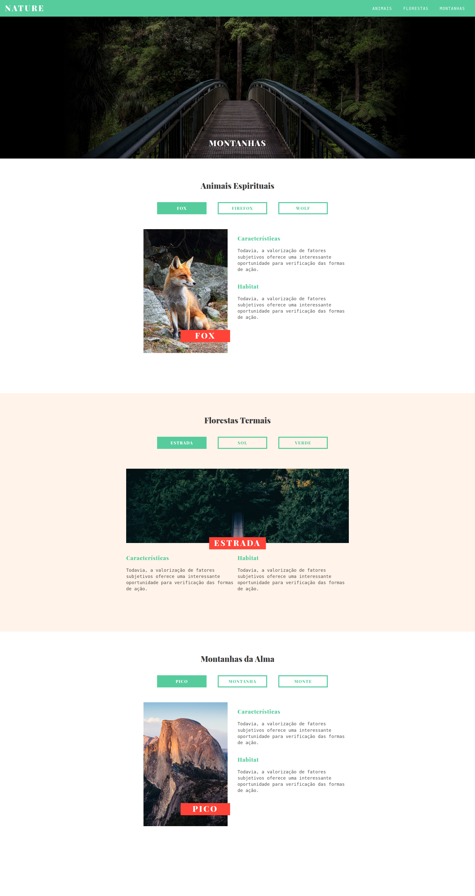

# JavaScript e Jquery - Básico

Curso de Jquery Básico - [Origamid](https://www.origamid.com/curso/javascript-e-jquery)

___

## Projeto Nature - [Demo](https://matheusgomesweb.github.io/Cursos/Programacao/FrontEnd/Cursos-Origamid/JavaScript-e-Jquery/index.html)
