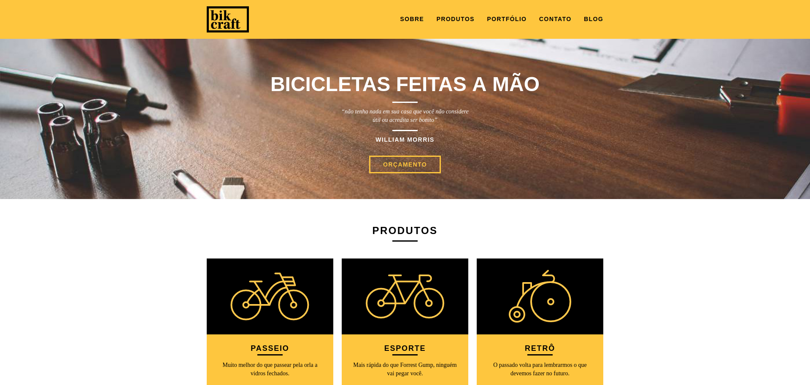

# Curso de Web Design Completo - [Origamid](https://www.origamid.com/curso/web-design-completo) - Finalizado

## Objetivo do Curso

Ensinar na prática como criar um **site responsivo do zero**, do **Design ao Código**, sem a necessidade de conhecimentos anteriores na área.

___

## Projeto do Curso - [bikecraft](https://bikcraft.com/)

___

## Oque aprendi

* **Etapas de Levantamento de Requisitos do Software**
  + Prototipação do site utilizando o ADOBE XD
  + Wireframe

* **Teoria do Design**
  + Uso de tipografia
  + Fontes Sem Serifa e com Serifa
  + Dicas de quantidade de fontes e cores em um website
  + Consistência de fontes e cores

* **Básico de Codificação**
  + Tags HTML
  + Tags CSS
  + Dom Javascript
  + Plugins e bibliotecas JavaScript para animações
  + Design Responsivo (Media queries)

* **Otimizações**
  + SEO e HEAD
  + Hospedagem
  + Analytics

* **Dicas**
  + Buscar inspiração em projetos Bons 
  
___

## Etapas para Construção de um site

* **Briefing**: Objetivos do Site, Necessidade dos usuários - **Levantamento de Requisitos**
  + [Modelo de Brifing](https://github.com/MatheusGomesWeb/Cursos-Origamid/tree/master/WebDesign-Completo/bikecraft/planejamento/bikcraft_briefing.pdf)
* **Arquitetura da informação**: Define as principais areas do site e o seu conteúdo. **Análise dos Requisitos**
  + [Modelo de Arquitetura de Informação (AI)](https://github.com/MatheusGomesWeb/Cursos-Origamid/tree/master/WebDesign-Completo/bikecraft/planejamento/bikcraft_ai.pdf)
* **Wireframe**: Design de interação.
* **Design**: Define as cores, imagens e estilo.
* **Código**: Codifica o layout e implementa o CMS.

___

## Tecnologias

* [HTML5](https://developer.mozilla.org/pt-BR/docs/Web/HTML)
* [CSS3](https://developer.mozilla.org/pt-BR/docs/Web/CSS)
* [JavaScript](https://developer.mozilla.org/pt-BR/docs/Web/JavaScript)
* [Design Responsivo](https://medium.com/@fnandaleite/entendendo-as-diferen%C3%A7as-entre-design-responsivo-adaptativo-e-mobile-first-ea3c61fc9181)

___

## Ferramentas

  + [Adobe Photoshop](https://www.adobe.com/br/products/photoshop.html)
  + [Adobe XD](https://www.adobe.com/br/products/xd.html)

  + **Paleta de Cores**
  + [Adobe Color CC](https://color.adobe.com/pt/create/color-wheel) 

  + **Fontes personalizadas**
  + [Adobe Edge Web Fonts](https://fonts.adobe.com/)
  + [Google Fonts](https://fonts.google.com/)
  + [fontsquirrel](https://www.fontsquirrel.com/)

  + **Inspiração de design**
  + [dribbble](https://dribbble.com/)
  + [design-seeds](https://www.design-seeds.com/)

  + **grid system**
  + [960 Grid System](https://960.gs/)

___

## Professor - André Rafael

  + **Formado em Administração de Empresas e Design Digital** - UFRJ / Infnet
  + **Fundador da Origamid**
  + **Prêmios de Web Design**
    - Nomeado no **Css Awwwards** e ganhador no **CSS Reel** como site do dia.
