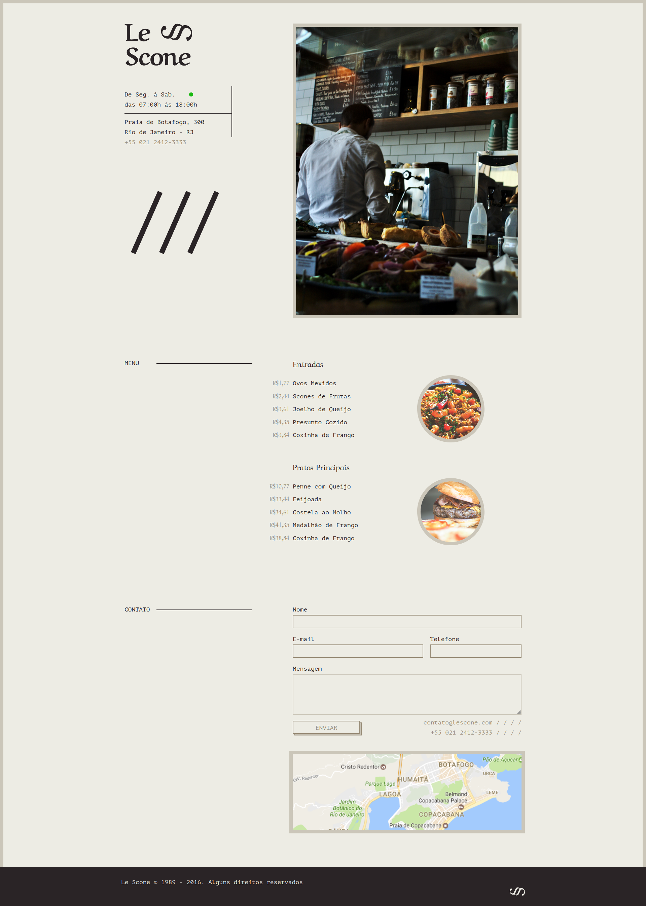

# CSS com SASS - Concluído

## Projeto Final: Le Scone - [Demo](https://matheusgomesweb.github.io/Cursos/Programacao/FrontEnd/Cursos-Origamid/css-com-SASS/Projeto-Final/le-scone//index.html)

**Módulos**

* [Fundamentos do SASS](https://github.com/MatheusGomesWeb/Cursos/tree/master/Programacao/FrontEnd/Cursos-Origamid/css-com-SASS/Fundamentos-SASS)
* [SASS na prática](https://github.com/MatheusGomesWeb/Cursos/tree/master/Programacao/FrontEnd/Cursos-Origamid/css-com-SASS/SASS-na-pratica)
  + [Bikecraft](https://github.com/MatheusGomesWeb/Cursos/tree/master/Programacao/FrontEnd/Cursos-Origamid/css-com-SASS/SASS-na-pratica/bikcraft)
* [Projeto Final](https://github.com/MatheusGomesWeb/Cursos/tree/master/Programacao/FrontEnd/Cursos-Origamid/css-com-SASS/Projeto-Final)
  + [Le Scone](https://github.com/MatheusGomesWeb/Cursos/tree/master/Programacao/FrontEnd/Cursos-Origamid/css-com-SASS/Projeto-Final/le-scone)
  
## Minhas modificações

* **JavaScript**
  + Scroll Suave ao clicar nos links do menu
  + Menu Mobile
  + Animaçao das seções ao Scroll
  + Debounce
  + Validação de Formulário com RegExp
  + Slideshow
  + Scroll para o Topo
  
 ## Ferramentas
  + Webpack
  + Gulp
  + Eslint
