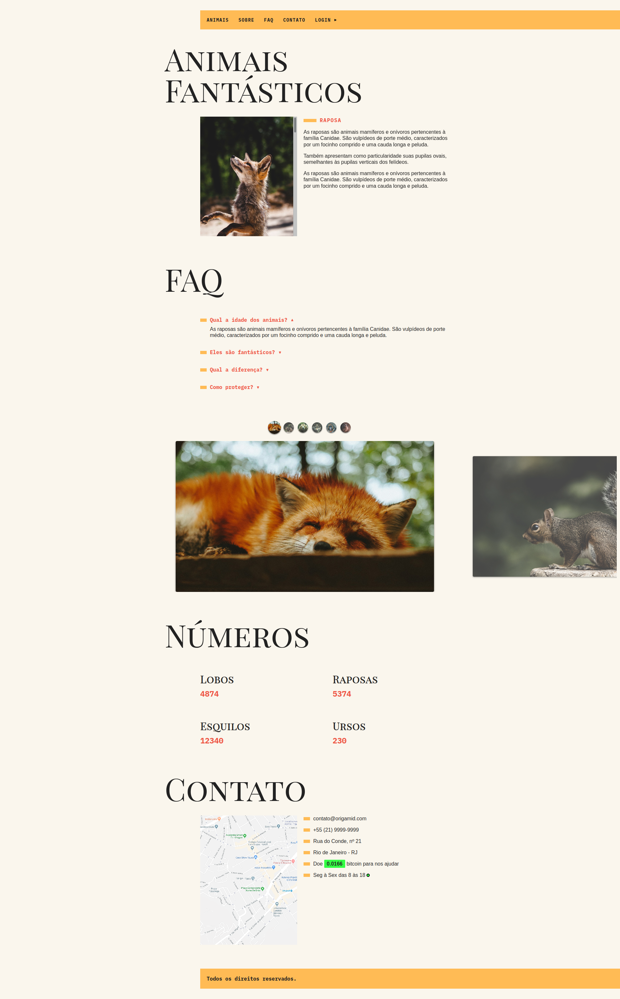

# Curso JavaScript ES6 - Completo - [Origamid](https://www.origamid.com/curso/javascript-completo-es6/) - Concluído

## Projeto Final: Animais Fantásticos - [Demo](https://matheusgomesweb.github.io/cursos/Programacao/FrontEnd/Cursos-Origamid/JavaScript-ES6-Completo/Projeto-Final/index.html)

___

## Modulos do Curso

* **JavaScript Para Iniciantes**
  + [Variáveis](https://github.com/MatheusGomesWeb/Cursos/tree/master/Programacao/FrontEnd/Cursos-Origamid/JavaScript-ES6-Completo/JavaScript-para-Iniciantes/Variaveis)
  + [Tipos de Dados](https://github.com/MatheusGomesWeb/Cursos/tree/master/Programacao/FrontEnd/Cursos-Origamid/JavaScript-ES6-Completo/JavaScript-para-Iniciantes/Tipos-de-Dados)
  + [Números e Operadores](https://github.com/MatheusGomesWeb/Cursos/tree/master/Programacao/FrontEnd/Cursos-Origamid/JavaScript-ES6-Completo/JavaScript-para-Iniciantes/Numeros-e-Operadores)
  + [Boolean e Condicionais](https://github.com/MatheusGomesWeb/Cursos/tree/master/Programacao/FrontEnd/Cursos-Origamid/JavaScript-ES6-Completo/JavaScript-para-Iniciantes/Boolean-e-Condicionais)
  + [Funções](https://github.com/MatheusGomesWeb/Cursos/tree/master/Programacao/FrontEnd/Cursos-Origamid/JavaScript-ES6-Completo/JavaScript-para-Iniciantes/Funcoes)
  + [Objetos](https://github.com/MatheusGomesWeb/Cursos/tree/master/Programacao/FrontEnd/Cursos-Origamid/JavaScript-ES6-Completo/JavaScript-para-Iniciantes/Objetos)
  + [Arrays e Loops](https://github.com/MatheusGomesWeb/Cursos/tree/master/Programacao/FrontEnd/Cursos-Origamid/JavaScript-ES6-Completo/JavaScript-para-Iniciantes/Arrays-e-Loops)
  + [Operadores de Atribuição e Ternário](https://github.com/MatheusGomesWeb/Cursos/tree/master/Programacao/FrontEnd/Cursos-Origamid/JavaScript-ES6-Completo/JavaScript-para-Iniciantes/Atribuicao-Ternario)
  + [Escopo](https://github.com/MatheusGomesWeb/Cursos/tree/master/Programacao/FrontEnd/Cursos-Origamid/JavaScript-ES6-Completo/JavaScript-para-Iniciantes/Escopo)
* **DOM Para Iniciantes**
  + [Oque é Dom ?](https://github.com/MatheusGomesWeb/Cursos/tree/master/Programacao/FrontEnd/Cursos-Origamid/JavaScript-ES6-Completo/Dom-Para-Iniciantes/oque-e-dom)
  + [Html e Css do Projeto](https://github.com/MatheusGomesWeb/Cursos/tree/master/Programacao/FrontEnd/Cursos-Origamid/JavaScript-ES6-Completo/Dom-Para-Iniciantes/html-e-css-do-projeto)
  + [Seleção de Elementos](https://github.com/MatheusGomesWeb/Cursos/tree/master/Programacao/FrontEnd/Cursos-Origamid/JavaScript-ES6-Completo/Dom-Para-Iniciantes/selecao-de-elementos)
  + [forEach e Arrow Functions](https://github.com/MatheusGomesWeb/Cursos/tree/master/Programacao/FrontEnd/Cursos-Origamid/JavaScript-ES6-Completo/Dom-Para-Iniciantes/forEach-e-arrow-functions)
  + [Classes e Atributos](https://github.com/MatheusGomesWeb/Cursos/tree/master/Programacao/FrontEnd/Cursos-Origamid/JavaScript-ES6-Completo/Dom-Para-Iniciantes/classes-e-atributos)
  + [Dimensôes e Distâncias](https://github.com/MatheusGomesWeb/Cursos/tree/master/Programacao/FrontEnd/Cursos-Origamid/JavaScript-ES6-Completo/Dom-Para-Iniciantes/dimensoes-e-distancias)
  + [Eventos](https://github.com/MatheusGomesWeb/Cursos/tree/master/Programacao/FrontEnd/Cursos-Origamid/JavaScript-ES6-Completo/Dom-Para-Iniciantes/eventos)
  + [Transversing e Manipulação](https://github.com/MatheusGomesWeb/Cursos/tree/master/Programacao/FrontEnd/Cursos-Origamid/JavaScript-ES6-Completo/Dom-Para-Iniciantes/transversing-e-manipulacao)
  + [Navegação por Tabs](https://github.com/MatheusGomesWeb/Cursos/tree/master/Programacao/FrontEnd/Cursos-Origamid/JavaScript-ES6-Completo/Dom-Para-Iniciantes/navegacao-por-tabs)
  + [Accordion List](https://github.com/MatheusGomesWeb/Cursos/tree/master/Programacao/FrontEnd/Cursos-Origamid/JavaScript-ES6-Completo/Dom-Para-Iniciantes/accordion-list)
  + [Scroll Suave nos Links Internos](https://github.com/MatheusGomesWeb/Cursos/tree/master/Programacao/FrontEnd/Cursos-Origamid/JavaScript-ES6-Completo/Dom-Para-Iniciantes/scroll-suave-link-interno)
  + [Animação ao Scroll](https://github.com/MatheusGomesWeb/Cursos/tree/master/Programacao/FrontEnd/Cursos-Origamid/JavaScript-ES6-Completo/Dom-Para-Iniciantes/animacao-ao-scroll)
* **Objetos**
  + [Constructor Functions](https://github.com/MatheusGomesWeb/Cursos/tree/master/Programacao/FrontEnd/Cursos-Origamid/JavaScript-ES6-Completo/Objetos/constructor-functions)
  + [Prototype](https://github.com/MatheusGomesWeb/Cursos/tree/master/Programacao/FrontEnd/Cursos-Origamid/JavaScript-ES6-Completo/Objetos/prototype)
  + [Native, Host e User](https://github.com/MatheusGomesWeb/Cursos/tree/master/Programacao/FrontEnd/Cursos-Origamid/JavaScript-ES6-Completo/Objetos/native-host-e-user)
  + [String](https://github.com/MatheusGomesWeb/Cursos/tree/master/Programacao/FrontEnd/Cursos-Origamid/JavaScript-ES6-Completo/Objetos/string)
  + [Number e Math](https://github.com/MatheusGomesWeb/Cursos/tree/master/Programacao/FrontEnd/Cursos-Origamid/JavaScript-ES6-Completo/Objetos/number-e-math)
  + [Array](https://github.com/MatheusGomesWeb/Cursos/tree/master/Programacao/FrontEnd/Cursos-Origamid/JavaScript-ES6-Completo/Objetos/array)
  + [Array e Iteração](https://github.com/MatheusGomesWeb/Cursos/tree/master/Programacao/FrontEnd/Cursos-Origamid/JavaScript-ES6-Completo/Objetos/array-e-iteracao)
  + [Functions - call(), apply(), bind()](https://github.com/MatheusGomesWeb/Cursos/tree/master/Programacao/FrontEnd/Cursos-Origamid/JavaScript-ES6-Completo/Objetos/functions)
  + [Objetos - freeze(), getOwnPropertiesName() etc...](https://github.com/MatheusGomesWeb/Cursos/tree/master/Programacao/FrontEnd/Cursos-Origamid/JavaScript-ES6-Completo/Objetos/objetos)
* **Modules**
  + [Modules](https://github.com/MatheusGomesWeb/Cursos/tree/master/Programacao/FrontEnd/Cursos-Origamid/JavaScript-ES6-Completo/Modules)
  + [Html e Css do Projeto organizado em Modules](https://github.com/MatheusGomesWeb/Cursos/tree/master/Programacao/FrontEnd/Cursos-Origamid/JavaScript-ES6-Completo/Modules/html-e-css-do-projeto)
* **Efeitos no Dom**
  + [Dataset](https://github.com/MatheusGomesWeb/Cursos/tree/master/Programacao/FrontEnd/Cursos-Origamid/JavaScript-ES6-Completo/Efeitos-no-Dom/dataset)
  + [Modal](https://github.com/MatheusGomesWeb/Cursos/tree/master/Programacao/FrontEnd/Cursos-Origamid/JavaScript-ES6-Completo/Efeitos-no-Dom/modal)
  + [Tooltip](https://github.com/MatheusGomesWeb/Cursos/tree/master/Programacao/FrontEnd/Cursos-Origamid/JavaScript-ES6-Completo/Efeitos-no-Dom/Tooltip)
  + [Dropdown Menu](https://github.com/MatheusGomesWeb/Cursos/tree/master/Programacao/FrontEnd/Cursos-Origamid/JavaScript-ES6-Completo/Efeitos-no-Dom/dropdown-menu)
  + [SetTimeout e setInterval](https://github.com/MatheusGomesWeb/Cursos/tree/master/Programacao/FrontEnd/Cursos-Origamid/JavaScript-ES6-Completo/Efeitos-no-Dom/setTimeOut-e-setInterval)
  + [Menu Mobile](https://github.com/MatheusGomesWeb/Cursos/tree/master/Programacao/FrontEnd/Cursos-Origamid/JavaScript-ES6-Completo/Efeitos-no-Dom/menu-mobile)
  + [Animar Numeros](https://github.com/MatheusGomesWeb/Cursos/tree/master/Programacao/FrontEnd/Cursos-Origamid/JavaScript-ES6-Completo/Efeitos-no-Dom/animar-numeros)
  + [Date](https://github.com/MatheusGomesWeb/Cursos/tree/master/Programacao/FrontEnd/Cursos-Origamid/JavaScript-ES6-Completo/Objetos/date)
  + [Forms](https://github.com/MatheusGomesWeb/Cursos/tree/master/Programacao/FrontEnd/Cursos-Origamid/JavaScript-ES6-Completo/Efeitos-no-Dom/forms)
  + [Prática: Button Creator](https://github.com/MatheusGomesWeb/Cursos/tree/master/Programacao/FrontEnd/Cursos-Origamid/JavaScript-ES6-Completo/Efeitos-no-Dom/button-creator)
* **LocalStorage**
  + [LocalStorage](https://github.com/MatheusGomesWeb/Cursos/tree/master/Programacao/FrontEnd/Cursos-Origamid/JavaScript-ES6-Completo/LocalStorage)
* **JavaScript Assíncrono**
  + [Definição JavaScript Assíncrono](https://github.com/MatheusGomesWeb/Cursos/tree/master/Programacao/FrontEnd/Cursos-Origamid/JavaScript-ES6-Completo/JavaScript-Assincrono/definicao-javascript-assincrono)
  + [Promise](https://github.com/MatheusGomesWeb/Cursos/tree/master/Programacao/FrontEnd/Cursos-Origamid/JavaScript-ES6-Completo/JavaScript-Assincrono/promise)
  + [Fetch](https://github.com/MatheusGomesWeb/Cursos/tree/master/Programacao/FrontEnd/Cursos-Origamid/JavaScript-ES6-Completo/JavaScript-Assincrono/fetch)
  + [JSON](https://github.com/MatheusGomesWeb/Cursos/tree/master/Programacao/FrontEnd/Cursos-Origamid/JavaScript-ES6-Completo/JavaScript-Assincrono/json)
  + [API e HTTP](https://github.com/MatheusGomesWeb/Cursos/tree/master/Programacao/FrontEnd/Cursos-Origamid/JavaScript-ES6-Completo/JavaScript-Assincrono/api-e-http)
  + [Async / Await](https://github.com/MatheusGomesWeb/Cursos/tree/master/Programacao/FrontEnd/Cursos-Origamid/JavaScript-ES6-Completo/JavaScript-Assincrono/async-await)
  + [History API](https://github.com/MatheusGomesWeb/Cursos/tree/master/Programacao/FrontEnd/Cursos-Origamid/JavaScript-ES6-Completo/JavaScript-Assincrono/history-api)
  + [Animais Fetch](https://github.com/MatheusGomesWeb/Cursos/tree/master/Programacao/FrontEnd/Cursos-Origamid/JavaScript-ES6-Completo/JavaScript-Assincrono/animais-fetch)
  + [Bitcoins Fetch](https://github.com/MatheusGomesWeb/Cursos/tree/master/Programacao/FrontEnd/Cursos-Origamid/JavaScript-ES6-Completo/JavaScript-Assincrono/bitcoins-fetch)
* **Classes**
  + [Classes](https://github.com/MatheusGomesWeb/Cursos/tree/master/Programacao/FrontEnd/Cursos-Origamid/JavaScript-ES6-Completo/Classes/classes)
  + [Get e Set](https://github.com/MatheusGomesWeb/Cursos/tree/master/Programacao/FrontEnd/Cursos-Origamid/JavaScript-ES6-Completo/Classes/get-e-set)
  + [Extends](https://github.com/MatheusGomesWeb/Cursos/tree/master/Programacao/FrontEnd/Cursos-Origamid/JavaScript-ES6-Completo/Classes/extends)
  + [Countdown](https://github.com/MatheusGomesWeb/Cursos/tree/master/Programacao/FrontEnd/Cursos-Origamid/JavaScript-ES6-Completo/Classes/countdown)
* **Mais JavaScript**
  + [Function Expression](https://github.com/MatheusGomesWeb/Cursos/tree/master/Programacao/FrontEnd/Cursos-Origamid/JavaScript-ES6-Completo/Mais-JavaScript/function-expression)
  + [Factory Function](https://github.com/MatheusGomesWeb/Cursos/tree/master/Programacao/FrontEnd/Cursos-Origamid/JavaScript-ES6-Completo/Mais-JavaScript/factory-function)
  + [Clojures e Debugging](https://github.com/MatheusGomesWeb/Cursos/tree/master/Programacao/FrontEnd/Cursos-Origamid/JavaScript-ES6-Completo/Mais-JavaScript/clojures-e-debugging)
  + [Destructuring](https://github.com/MatheusGomesWeb/Cursos/tree/master/Programacao/FrontEnd/Cursos-Origamid/JavaScript-ES6-Completo/Mais-JavaScript/destructuring)
  + [Rest e Spread](https://github.com/MatheusGomesWeb/Cursos/tree/master/Programacao/FrontEnd/Cursos-Origamid/JavaScript-ES6-Completo/Mais-JavaScript/rest-e-spread)
  + [Loops e Iterable](https://github.com/MatheusGomesWeb/Cursos/tree/master/Programacao/FrontEnd/Cursos-Origamid/JavaScript-ES6-Completo/Mais-JavaScript/loops-e-iterable)
* **Regular Expression**
  + [Regular Expression](https://github.com/MatheusGomesWeb/Cursos/tree/master/Programacao/FrontEnd/Cursos-Origamid/JavaScript-ES6-Completo/regular-expression)
* **Automação Front-End**
  + [Linha de Comando](https://github.com/MatheusGomesWeb/Cursos/tree/master/Programacao/FrontEnd/Cursos-Origamid/JavaScript-ES6-Completo/linha-de-comando)
  + [NPM](https://github.com/MatheusGomesWeb/Cursos/tree/master/Programacao/FrontEnd/Cursos-Origamid/JavaScript-ES6-Completo/npm)
  + [ESLint](https://github.com/MatheusGomesWeb/Cursos/tree/master/Programacao/FrontEnd/Cursos-Origamid/JavaScript-ES6-Completo/eslint)
  + [Webpack](https://github.com/MatheusGomesWeb/Cursos/tree/master/Programacao/FrontEnd/Cursos-Origamid/JavaScript-ES6-Completo/webpack)
  + [Babel](https://github.com/MatheusGomesWeb/Cursos/tree/master/Programacao/FrontEnd/Cursos-Origamid/JavaScript-ES6-Completo/babel)
  + [Git e Github](https://github.com/MatheusGomesWeb/Cursos/tree/master/Programacao/FrontEnd/Cursos-Origamid/JavaScript-ES6-Completo/git)
* **HTML e CSS do Projeto**
  + [HTML e CSS do Projeto](https://github.com/MatheusGomesWeb/Cursos/tree/master/Programacao/FrontEnd/Cursos-Origamid/JavaScript-ES6-Completo/html-e-css-do-projeto)
* **Projeto Final**
  + [Projeto Final](https://github.com/MatheusGomesWeb/Cursos/tree/master/Programacao/FrontEnd/Cursos-Origamid/JavaScript-ES6-Completo/Projeto-Final)
* **Extra: Slide**
  + [Slide](https://github.com/MatheusGomesWeb/Cursos/tree/master/Programacao/FrontEnd/Cursos-Origamid/JavaScript-ES6-Completo/Extras/slide)

* **Documentação JavaScript - Origamid**
* [Documentação do Curso para Consultar sobre JavaScript](https://www.origamid.com/slide/javascript-completo-es6/#/0101-javascript-completo-es6/1)
